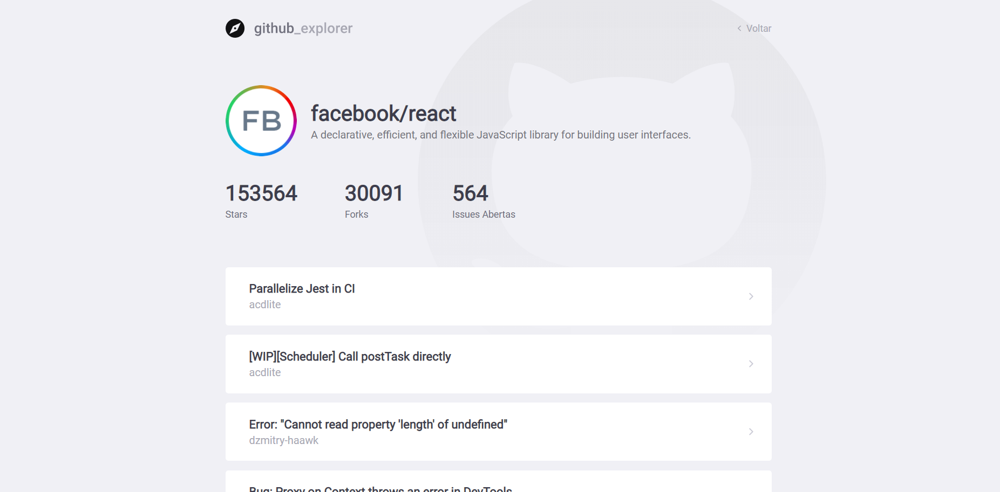

# GithubExplorer  🧑🏻‍💻  🕵🏽‍♂️
Explore repositórios no GitHub
#

#

## Tecnologias utilizadas
- React
- Typescript
- Styled Components
### Ferramentas de padronização de Código
- Editorconfig
- Eslint
- Prettier
